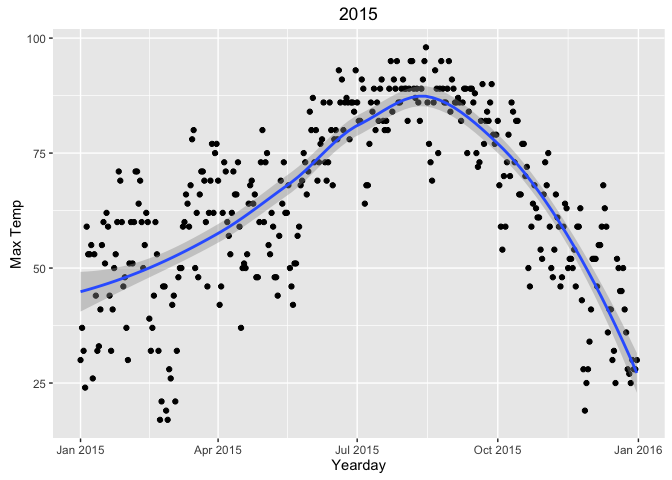
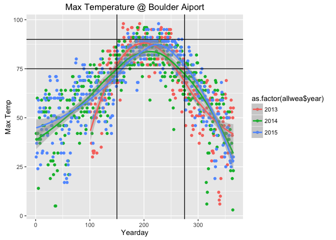
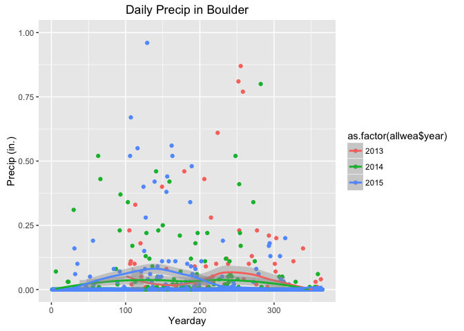

# Will it Rain On My Wedding?
Andy Pickering  
August 2, 2016  


### We are thinking of having our wedding in Estes Park CO next September. What are the chances it will rain, and what will the temperature be? Should we have it at a different time?


```r
rm(list=ls())
library(ggplot2)
library(lubridate)
```

```
## 
## Attaching package: 'lubridate'
```

```
## The following object is masked from 'package:base':
## 
##     date
```

#### First we need some weather data, which I'll get data from wunderground.com
#### I'll write a function to get the data for a specified year from the Boulder airport:

```r
get_weather <- function(whyear){
url<-paste0("https://www.wunderground.com/history/airport/KBDU/",whyear,"/1/1/CustomHistory.html?dayend=31&monthend=12&yearend=",whyear,"&req_city=&req_state=&req_statename=&reqdb.zip=&reqdb.magic=&reqdb.wmo=&format=1")
fname<-paste0("KBDUWeather",whyear,".csv")
download.file(url,fname)
wea<-read.csv(fname)
wea$MST <- as.Date(wea$MST,"%Y-%m-%d")
wea$month <- months(wea$MST)
wea$yday <- yday(wea$MST)
wea$year <- year(wea$MST)
wea
}
```


### Let's take a look at the daily max temperature for just last year.

```r
wea<-get_weather("2015")
qplot(wea$MST,wea$Max.Temperature,geom=c("point","smooth"),xlab='Yearday',ylab='Max Temp',main='2015')
```

<!-- -->

### Now let's get a couple years of data to see how much variability there is. For this station, there is only data from early 2013 on. I'll plot versus yearday so that we can compare different years on the same axes too.


```r
wea13<-get_weather("2013")
wea14<-get_weather("2014")
wea15<-get_weather("2015")
allwea=rbind(wea13,wea14,wea15)
qplot(allwea$yday,allwea$Max.Temperature,color=as.factor(allwea$year),geom=c("point","smooth"),xlab='Yearday',ylab='Max Temp',main='Max Temperature @ Boulder Aiport') + geom_hline(yintercept=75)  + geom_hline(yintercept=90)+geom_vline(xintercept = 150)+geom_vline(xintercept = 275)
```

<!-- -->

So the peak temperature occurs around yearday 200 (July 19), plus/minus maybe 20 days. There is also less variability during the summer months, and more during the winter (a larger range between the values from different years). I'd say we want the max temp to be greater than 75, and less than 90 for our ideal wedding day (Kate would probably want it hotter :) .

## What about rain?
We want to have an outdoor wedding, so obviously we don't want it to rain (during the ceremony at least). I'll plot the measured precipitation in inches to try to get an idea of the rain pattern:

```r
# convert precipitation to numeric values (T=NA here)
allwea$PrecipNum <- as.numeric(as.character(allwea$PrecipitationIn))
qplot(allwea$yday,allwea$PrecipitationIn,color=as.factor(allwea$year),geom=c("point","smooth"),xlab='Yearday',ylab='Precip (in.)',main='Daily Precip in Boulder')+ylim(0,1)
```

```
## Warning: Removed 4 rows containing non-finite values (stat_smooth).
```

```
## Warning: Removed 4 rows containing missing values (geom_point).
```

```
## Warning: Removed 15 rows containing missing values (geom_smooth).
```

<!-- -->

It looks like rain is much trickier. There seems to be a bit of a seasonal cycle (more large events occuring during middle of year), but it is a lot noisier. This makes sense; around here the rain is usually in localized thunderstorms, which can vary a lot with location as well as time. Temperature in contrast is less variable in location; if it is 90 degrees here, it's pretty unlikely it will be 50 degrees one town over! 

## Summary: So what did we learn?

1- For the range of temperatures we would prefer, we should choose a date between May 30 and October 2.

2- It's very hard to predict rain. During this time of year, rain is usually from localized, intermittent thunderstorms. We might just have to hope for good luck. At least the thunderstorms don't usually last very long, so we can probably wait it out. And I like watching them too :).

3- I do know from personal experience that thunderstorms tend to occur in the afternoon/evening. So a morning ceremony might be safer.

4- It would be interesting to look at other locations and where there is more historical data to see how variable these patterns are.
